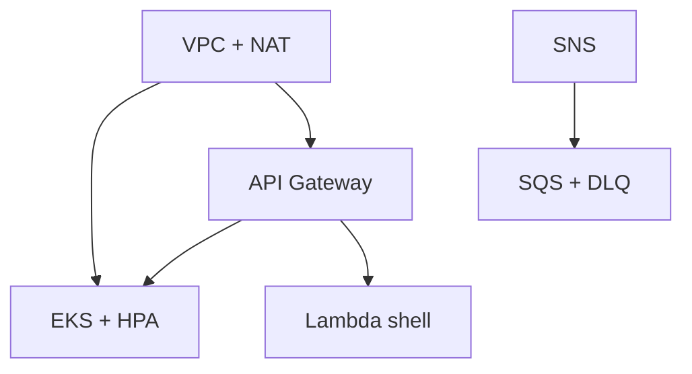

# tech-challenge-infra-kubernetes

Infraestrutura de computação e borda da oficina mecânica: VPC, EKS, ECR, API Gateway, Functions (shell), mensageria, observabilidade Datadog e parâmetros SSM para integração cross-repo.

## Propósito e limites

| Dentro deste repo                                            | Fora deste repo                                  |
| ------------------------------------------------------------ | ------------------------------------------------ |
| Terraform de rede, cluster, borda, filas, dashboards Datadog | Código das Lambdas → `tech-challenge-serverless` |
| Exports SSM `/tech-challenge/producao/infra/*`               | RDS → `tech-challenge-infra-database`            |
| CI/CD Terraform (validate/plan/apply)                        | Manifests K8s da app → `tech-challenge-oficina`  |

## Tecnologias

| Tecnologia                                         | Versão                 |
| -------------------------------------------------- | ---------------------- |
| Terraform                                          | >= 1.5                 |
| AWS (VPC, EKS, ECR, API GW, Lambda shell, SNS/SQS) | região us-east-1       |
| Datadog provider                                   | dashboards + monitors  |
| GitHub Actions                                     | pr-validation + deploy |

## Arquitetura



## Responsabilidade

| Recurso                                   | Descricao                                                          |
| ----------------------------------------- | ------------------------------------------------------------------ |
| VPC + subnets                             | Rede privada/publica para EKS, Lambda e RDS                        |
| EKS + metrics-server + Cluster Autoscaler | Cluster Kubernetes da API NestJS com escala de nodes               |
| ECR                                       | Registro de imagens Docker da aplicacao                            |
| Lambda (shell)                            | Functions provisionadas; codigo vem de `tech-challenge-serverless` |
| S3                                        | Artefatos ZIP das Functions                                        |
| SSM                                       | Exports consumidos pelos demais repositorios                       |

## Repositórios relacionados

| Repositório                                | URL                                                       | Integração                              |
| ------------------------------------------ | --------------------------------------------------------- | --------------------------------------- |
| **tech-challenge-infra-kubernetes** (este) | https://github.com/7feeh7/tech-challenge-infra-kubernetes | Provisiona VPC, EKS, Gateway, SSM       |
| tech-challenge-infra-database              | https://github.com/7feeh7/tech-challenge-infra-database   | Consome SSM infra; publica SSM database |
| tech-challenge-serverless                  | https://github.com/7feeh7/tech-challenge-serverless       | Upload ZIP + update Lambda              |
| tech-challenge-oficina                     | https://github.com/7feeh7/tech-challenge-oficina          | Deploy EKS; Swagger em `/docs`          |

## Ordem de provisionamento

1. **tech-challenge-infra-kubernetes** (este repo) — **1º**
2. **tech-challenge-infra-database** — 2º
3. **tech-challenge-serverless** — 3º
4. **tech-challenge-oficina** — 4º

## Deploy ativo

| Output / SSM              | Uso                            |
| ------------------------- | ------------------------------ |
| `api_gateway_url`         | URL pública da solução         |
| `eks_cluster_name`        | kubectl / CI da aplicação      |
| `ecr_repository_url`      | Push de imagem Docker          |
| `datadog_dashboard_*_url` | Dashboards (outputs Terraform) |

## Estrutura

```text
terraform/          Modulos Terraform
.github/workflows/  pr-validation (develop/PR) + deploy (main only)
docs/               Contratos e ADR
```

## Pre-requisitos

- Terraform >= 1.5
- AWS CLI configurado
- Bucket S3 + DynamoDB para state remoto
- GitHub Environment `producao` (secrets de nuvem; deployment branch policy = `main` only)

> **Ambiente único (001-R1):** não existe ambiente de homologação provisionado. `develop` executa apenas validação.

## Contratos SSM exportados

Prefixo: `/tech-challenge/producao/infra/`

| Parametro                      | Consumidor                        |
| ------------------------------ | --------------------------------- |
| `vpc_id`                       | infra-database                    |
| `private_subnet_ids`           | infra-database                    |
| `lambda_security_group_id`     | infra-database                    |
| `rds_access_security_group_id` | infra-database                    |
| `eks_cluster_name`             | tech-challenge CI                 |
| `ecr_repository_url`           | tech-challenge CI                 |
| `lambda_auth_function_name`    | serverless CI, infra-database     |
| `lambda_artifacts_bucket`      | serverless CI                     |
| `api_gateway_url`              | tech-challenge CI, documentação   |
| `api_gateway_auth_url`         | consumidores externos, Swagger    |
| `vpc_link_id`                  | observabilidade / troubleshooting |
| `eks_nlb_dns_name`             | healthcheck NLB (in-VPC)          |

## GitHub Secrets (Environment `producao`)

| Secret                                        | Uso                                |
| --------------------------------------------- | ---------------------------------- |
| `AWS_ACCESS_KEY_ID` / `AWS_SECRET_ACCESS_KEY` | Deploy Terraform                   |
| `TF_STATE_BUCKET`                             | Backend S3                         |
| `TF_STATE_LOCK_TABLE`                         | Lock DynamoDB                      |
| `JWT_SECRET`                                  | Env da Lambda auth                 |
| `DB_SECRET_ARN`                               | Opcional; preenchido apos database |
| `LAMBDA_ARTIFACTS_BUCKET`                     | Nome do bucket S3 de artefatos     |

`SONAR_TOKEN` e similares ficam no nivel de repositorio, se aplicavel.

## Branches e pipelines

| Branch      | Workflow            | Toca AWS |
| ----------- | ------------------- | -------- |
| `develop`   | `pr-validation.yml` | **nao**  |
| PR → `main` | `pr-validation.yml` | **nao**  |
| `main`      | `deploy.yml`        | **sim**  |

State S3 key: `tech-challenge-infra-kubernetes/producao/terraform.tfstate`

## Rollback

1. Reverta o commit no GitHub e faca merge na branch alvo.
2. O workflow `deploy.yml` aplicara o state anterior via Terraform.
3. Para destroy controlado, use `workflow_dispatch` com action `destroy`.

## Custo e teardown

Estimativa de custos, ordem segura de destruicao e pre-requisitos de backup em [`docs/custo-e-teardown.md`](docs/custo-e-teardown.md).

## Licenca

Projeto academico FIAP — uso interno da entrega.
